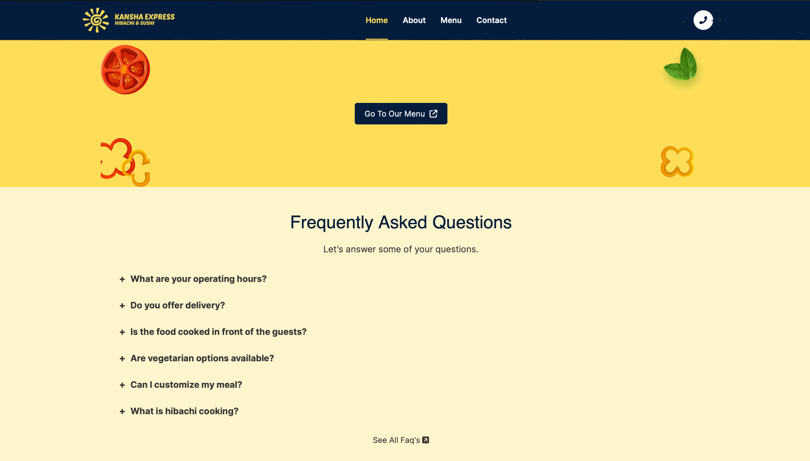
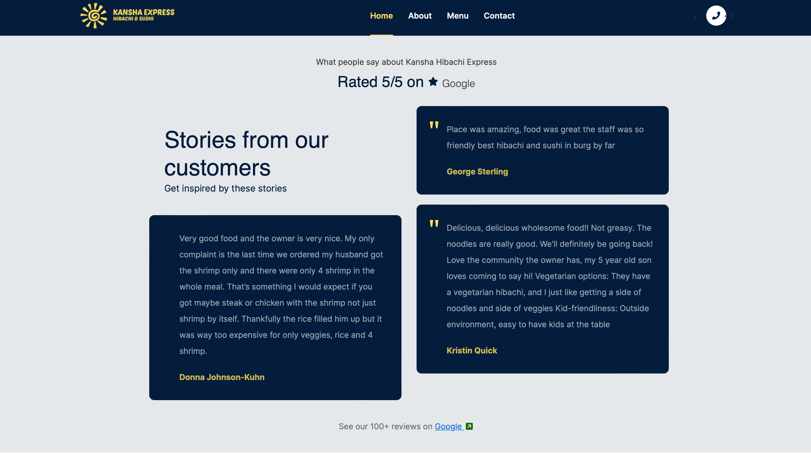
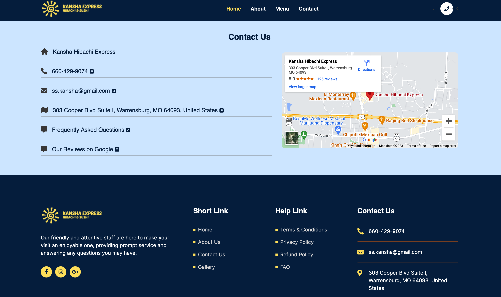
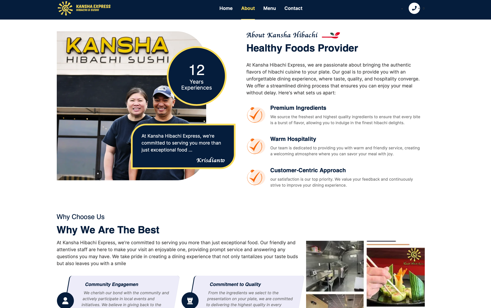
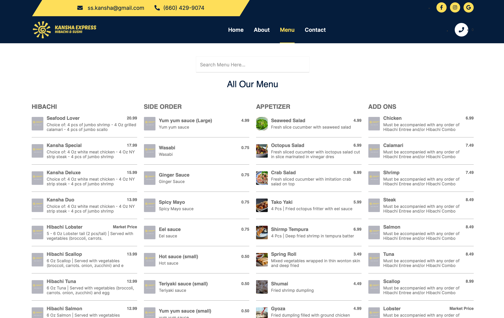
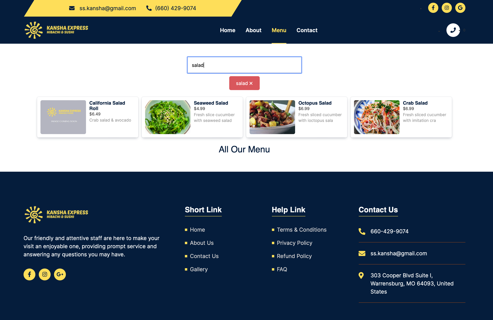
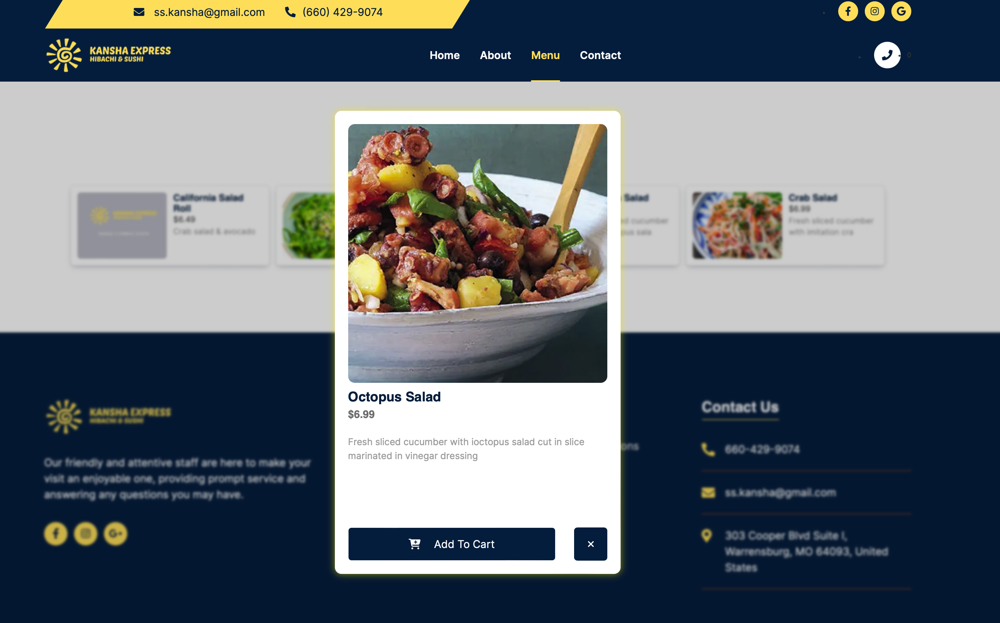
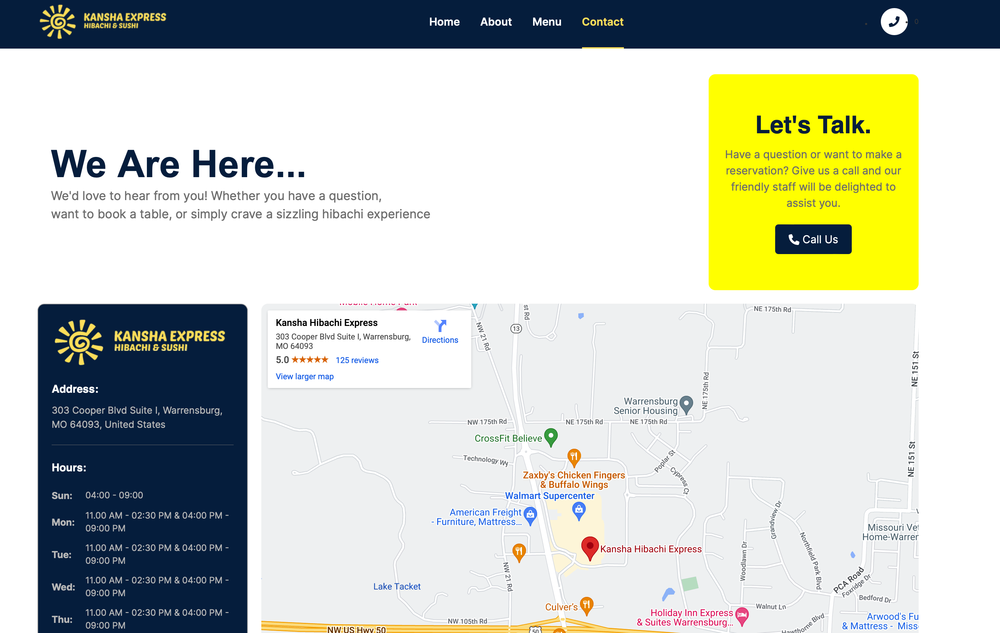

# Restaurant Website using Next.js, React, TypeScript, And More

Welcome to the repository! This project is a dynamic and modern website for a restaurant, developed using Next.js, React, TypeScript, and Node.js as a backend. It features an enticing user interface and a seamless browsing experience, all backed by a robust backend built with Node.js, Express, Sequelize, MySQL, and JWT authentication.

 
 
 
 
 

## Features

- Explore a mouthwatering menu and discover the culinary delights the restaurant has to offer.
- User-friendly navigation using React Router DOM for smooth page transitions.
- Visually appealing UI crafted with the power of React and enhanced with animations from the Framer Motion library.
- Stay informed with React Toastify notifications for important updates and events.
- Font Awesome icons add a touch of elegance to the design and improve user interaction.
- Utilize SASS for easy and organized styling, ensuring a consistent and aesthetically pleasing look.
- Secure user authentication and authorization powered by JWT, providing a safe and personalized experience.
- Backend powered by Node.js and Express, with Sequelize as the ORM for efficient database management.

## Technologies Used

- [Next.js](https://nextjs.org): React framework for server-rendered React applications, optimizing performance and SEO.
- [React](https://reactjs.org): Building interactive and dynamic user interfaces.
- [React](https://www.typescriptlang.org/): strongly typed programming language that builds on JavaScript, giving you better tooling at any scale.
- [Node.js](https://nodejs.org): Runtime environment for server-side JavaScript execution.
- [Express](https://expressjs.com): Fast, unopinionated, and minimalist web framework for Node.js.
- [Sequelize](https://sequelize.org): Promise-based Node.js ORM for MySQL database management.
- [MySQL](https://www.mysql.com): Robust and scalable relational database management system.
- [JSON Web Tokens (JWT)](https://jwt.io): Secure authentication method for transmitting information between parties.
- [Font Awesome](https://fontawesome.com): Comprehensive icon set and toolkit, enhancing visual elements.
- [React Toastify](https://fkhadra.github.io/react-toastify): Display stylish notifications to keep users informed.
- [SASS](https://sass-lang.com): CSS extension language for maintaining clean and organized styles.
- [Framer Motion](https://www.framer.com/motion/): Add smooth animations and transitions to elements for an engaging experience.
- [React Router DOM](https://reactrouter.com/web/guides/quick-start): Dynamic routing for single-page applications, improving navigation.

## Getting Started

1. Clone this repository to your local machine.
2. Navigate to the project directory: `cd kansha-missouri`.
3. Install the required dependencies: `npm install`.
4. Set up the database configuration in `backend/config/database.js`.
5. Run the backend server: `npm run server`.
6. Navigate to the `frontend` directory: `cd frontend`.
7. Run the frontend application: `npm run dev`.
8. Open your browser and visit: `http://localhost:3000`.

## Contributing

Contributions are welcome! Feel free to open a pull request or an issue if you find any bugs or want to suggest improvements.

## License

This project is licensed under the [MIT License].

---

Developed by [Wanda Azhar](https://wandaazhar.vercel.app)
